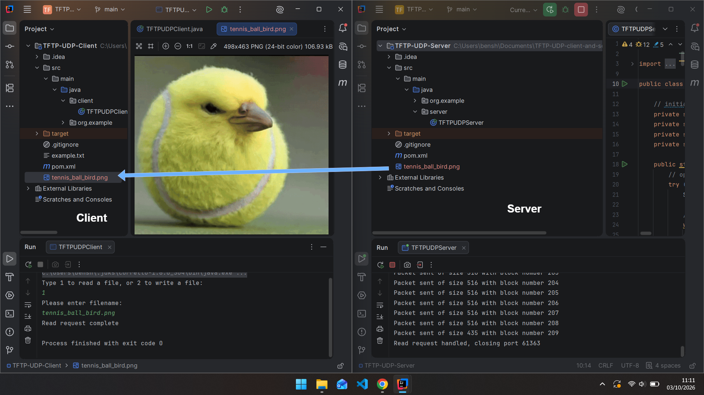
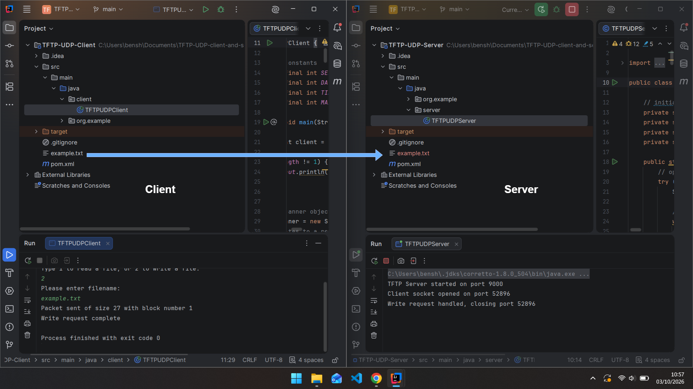

# TFTP Client & Server

### Trivial File Transfer Protocol Implementation



*TFTP client receiving image file transfer from server*

## Features

- TFTP client and server implementation over UDP
- File upload and download operations
- Packet parsing and construction
- Acknowledgement handling
- Timeout detection and packet retransmission

## About

**TFTP Client & Server** is a Java implementation of the **Trivial File Transfer Protocol (TFTP)** over UDP. The project implements the core functionality required for transferring files between a client and server, including packet handling, acknowledgements, timeout detection, and retransmission.

The implementation follows the TFTP protocol specification and was tested using client/server communication across a local network.



*TFTP client uploading text file to server.*

## Technology

- **Language:** Java
- **Protocol:** TFTP
- **Transport:** UDP
- **Build Tool:** Maven
- **Version Control:** Git


## Running the Application

The project uses **Maven** for dependency management and building.

Clone the repository and open the project in IntelliJ IDEA. IntelliJ should automatically detect the Maven project from the provided `pom.xml`.

The client and server can then be launched from their respective Java entry-point classes.

Alternatively, the project can be compiled using Maven:

```bash
mvn compile
```

---

## Post-Submission Updates

> **Repository Note:** This project was originally developed as part of my university coursework.
>
> The repository was later updated to improve documentation and presentation. These updates do not modify the original implementation or its functionality.